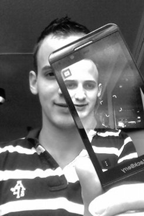

Trailer
=======

Say hi to [pixelplant.com](http://pixelplant.com)
[Flash to HTML5 conversion](http://pixelplant.com)

We are uxebu
============

Uxebu is a distributed team of passionate software developers.

We love what we do, and we’re continually innovating and adapting.

We build tools for developing and expressing ideas through open and standard web technologies.

By combining the specialized knowledge and skills of our team we aim to deliver quality software solutions and friendly knowledgeable service.

[Contact](#contact-form)

We are geeks
============

We embrace Open Source and Web Technologies. JavaScript and HTML5 is what we live and breathe.

We believe in worldwide creative collaboration.
We build our own tools, and we have created a range of relevant open source software.

We actively contribute to open source  projects and push new technologies to the maximum.

We also openly share our knowledge and thoughts, live on events and on our blog.

[Blog & Events](http://uxebu.com/blog)

Client Projects
===============

* [Vodafone](http://developer.vodafone.com)
  [Cross-platform development and testing strategy.](http://developer.vodafone.com)
* [Motorola](http://motorola.com)
  [HTML5 UI framework.](http://motorola.com)
* [MSN](http://msn.com)
  [HTML5 component development.](http://msn.com)
* [BMW](http://bmw.com)
  [Web application for innovation management.](http://bmw.com)
* [Deutsche Telekom](http://telekom.de)
  [Development of media center web application.](http://telekom.de)
* [PRO7](http://pro7.de)
  [HTML5 cross-platform video solution.](http://pro7.de)
* [Chip.de](http://chip.de)
  [A hand-selected iPhone AppStore catalog.](http://chip.de)

Projects
====================

* [Pixelplant](https://www.pixelplant.com/)
  [We convert Flash to HTML5](https://www.pixelplant.com/)
* [BonsaiJS](http://bonsaijs.org)
  [A lightweight graphics library with an intuitive graphics API and an SVG renderer](http://bonsaijs.org)
* [Gordon](https://github.com/tobeytailor/gordon)
  [Flash(TM) runtime in JavaScript](https://github.com/tobeytailor/gordon)
* [HumanAPI](http://humanapi.org)
  [Interface hardware with web technologies](http://humanapi.org)
* [TouchScroll](http://uxebu.com/blog/2010/04/27/touchscroll-a-scrolling-layer-for-webkit-mobile)
  [A scrolling layer to fix position:fixed on iOS](http://uxebu.com/blog/2010/04/27/touchscroll-a-scrolling-layer-for-webkit-mobile)

uxebu team
==========

* [Nikolai Onken](team/onken.html)
  CEO
  

* [Wolfram Kriesing](team/kriesing.html)
  CTO
  

* [Tobias von Klipstein](team/klipstein.html)
  COO
  

* [David Aurelio](team/aurelio.html)
  JavaScript Developer
  

* [Tobias Reiss](team/reiss.html)
  JavaScript Developer
  

* [Patrick Wied](team/wied.html)
  JavaScript Developer
  

Address & Phone
===============

uxebu was founded in 2008 and is based in Munich, Amsterdam and Palo Alto.

**uxebu Inc.**  
950 Page Mill Road  
Palo Alto, California 94304  
USA  

**Phone: [+49 89 122 219 626](tel:+4989122219626)**  
Fax: +49 89 122 219 626 - 8  
E-Mail: [contact @ uxebu.com](mailto:%63%6F%6E%74%61%63%74%40%75%78%65%62%75%2E%63%6F%6D)

[Impressum / Legal](/legal.html)
